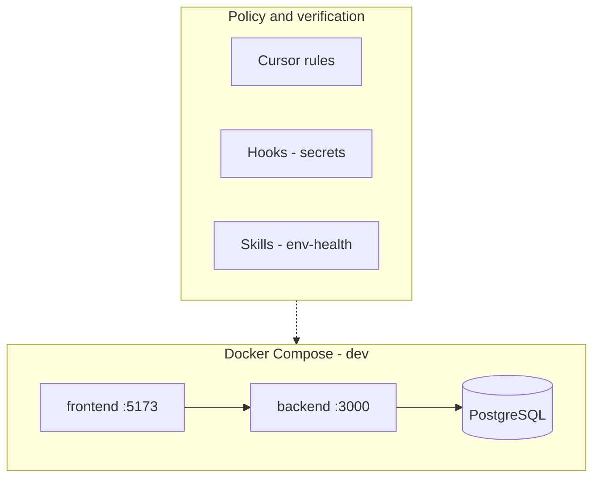

# Kanban App

**Kanban App** is a **Trello-style task tracker** (boards, lists, cards) built as a **portfolio-grade** full-stack product: system design, networking, security, SDLC, **DevSecOps**, and **AI-assisted engineering** with explicit **harness, context, and prompt** discipline.

| Goal | What reviewers should see |
|------|---------------------------|
| **Primary** | End-to-end ownership: containerized dev/prod, policy-as-code in the editor, documented controls, self-hosted edge narrative, traceable delivery (CI to registry). |
| **Secondary** | A usable **project / issue / task** tracker that grows from a **landing page (v1)** into **kanban workflows** and, later, **practice-aligned** boards (WIP limits, flow metrics, policies). |

The repository still ships **defense-in-depth defaults** (Compose topology, hardened `Dockerfile.prod`, hooks, rules, skills). That platform story **supports** the product story; they are not separate silos.

---

## Audience

Hiring managers and technical reviewers evaluating **systems thinking**, **segmented exposure**, **supply-chain-aware delivery**, and **governed AI-assisted change** (what is automated vs what remains human judgment).

---

## Architecture at a glance



- **Development:** `docker compose -f docker-compose.dev.yml` — bridge network `kanban_app_network`, bind mounts for hot reload, **Postgres not published** on the host by default (reduced surface).
- **Production images:** multi-stage frontend (static → **unprivileged nginx**); API on **Alpine**, **`npm ci`**, **`USER node`** (see [docs/ARCHITECTURE.md](docs/ARCHITECTURE.md)). Registry tags **`kanban-backend`** / **`kanban-frontend`** on Docker Hub match [`.github/workflows/ci.yml`](.github/workflows/ci.yml).
- **Portfolio hosting (v1):** **self-hosted** runtime and **identity-aware edge** using **[Pangolin](https://pangolin.net/)** (tunneled **reverse proxy**, **zero-trust–style** access) — details in [docs/ARCHITECTURE.md §1.1](docs/ARCHITECTURE.md#11-portfolio-deployment-posture-pangolin-reverse-proxy-and-zero-trust). Deeper network architecture evolves **after v2** alongside product features.
- **Optional:** `dev-workstation` (Compose **profile `tools`**) — SSH/tools container; **not** the app server.

---

## Security posture (summary)

| Control | Mechanism | Where |
|---------|-----------|--------|
| No secrets in VCS | `.gitignore` for `.env`; `.env.example` template | Root |
| Secret-pattern gates | Cursor hooks: shell scan, **Write** pre-scan, post-edit audit | `.cursor/hooks.json`, `.cursor/hooks/*.sh` |
| Least exposure (DB) | Postgres **not** mapped to host unless overlay | `docker-compose.dev.yml` vs `docker-compose.dev.db-host.yml` |
| Prod non-root / minimal runtime | Multi-stage build, `USER node` / unprivileged nginx | `*/Dockerfile.prod` |
| Reproducible installs | `npm ci`, lockfiles in app dirs | Dockerfiles |
| Documented controls | Architecture + matrix | [docs/ARCHITECTURE.md](docs/ARCHITECTURE.md), [docs/CONTROLS.md](docs/CONTROLS.md) |
| Health verification | Agent skill (no replacement for hooks) | [.cursor/skills/env-health/SKILL.md](.cursor/skills/env-health/SKILL.md) |

---

## DevSecOps workflow

1. **Develop** — Compose up; inject secrets via **1Password** (`op`) or env files **never committed**.
2. **Enforce** — Hooks block risky secret patterns in shell and **Write** payloads.
3. **Verify** — Invoke **`env-health`** skill for Compose/HTTP/DB checks (see skill file).
4. **Ship** — On push to **`main`**, GitHub Actions builds and pushes **`kanban-backend`** / **`kanban-frontend`** images (Docker Hub). Only **dev** and **prod** environments are in scope for now; further gates (PR checks, scans) are **planned**.

---

## AI-assisted engineering harness

- **Rules** (`.cursor/rules/`) encode stack, product phases, and security **expectations** (see [.cursor/rules](.cursor/rules)).
- **Hooks** implement **automated policy** for secret-like patterns (fail-closed where configured).
- **Skills** encode **repeatable verification** workflows.
- **Harness engineering** (how structured context and review loops support responsible use of LLMs on this repo) is described for **education and curiosity** in [docs/HARNESS_ENGINEERING.md](docs/HARNESS_ENGINEERING.md). **Kanban-specific** editor rules are planned for **v2** alongside domain features.

---

## Roadmap

Phased scope, auth, and tenancy are authoritative in **[docs/PRODUCT.md](docs/PRODUCT.md)**. Summary:

| Phase | Product | Auth / tenancy | Platform |
|-------|---------|----------------|----------|
| **v1** | Public **landing page**; stack wired (frontend, API, DB) | None | Compose + Pangolin narrative; Docker Hub on `main` |
| **v2** | Boards → lists → cards; drag-and-drop; description; due dates; labels; comments; attachments; search/filter; activity log | **Email / password**; **multi-tenant** data model | API style and real-time **decided after v2**; optional **kanban-specific** Cursor rules |
| **Final** | Kanban **best practices** (e.g. WIP limits, flow policies, metrics as agreed in PRODUCT) | **2FA**, **magic link** | Integrations (e.g. GitHub) **possible** |

---

## Quick start

```bash
docker compose -f docker-compose.dev.yml up -d
```

| Endpoint | URL |
|----------|-----|
| Kanban App UI (Vite) | [http://localhost:5173](http://localhost:5173) |
| API | [http://localhost:3000](http://localhost:3000) |

Optional: `--profile tools` for **dev-workstation**; merge **`docker-compose.dev.db-host.yml`** to expose Postgres on `localhost:5432`.

---

## Documentation

| Document | Purpose |
|----------|---------|
| [docs/PRODUCT.md](docs/PRODUCT.md) | Vision, phases, auth, tenancy, open decisions |
| [docs/ARCHITECTURE.md](docs/ARCHITECTURE.md) | Topology, volumes, prod images, secrets, Pangolin / ZTNA-style edge |
| [docs/CONTROLS.md](docs/CONTROLS.md) | Security / engineering controls matrix |
| [docs/HARNESS_ENGINEERING.md](docs/HARNESS_ENGINEERING.md) | Harness vs context; how AI support is documented here |
| [docs/GITHUB_METADATA.md](docs/GITHUB_METADATA.md) | Suggested GitHub description, topics, About text |

---

## Public repository

Primary remote: **[github.com/dominguesh/kanban-task-tracker](https://github.com/dominguesh/kanban-task-tracker)** — align **About** text and topics using [docs/GITHUB_METADATA.md](docs/GITHUB_METADATA.md).

---

## License

MIT — see [LICENSE](LICENSE).
